# Clinica OnLine (Clinic Management System)

Health clinic management system with multiple specialties and services. Manages appointments,
patients, specialists and admins through a web interface tailored to each user role (Patient,
Specialist, Admin).

## Stack

Angular, Firebase (Auth + Firestore), responsive design.

## Context

The clinic has:

- 6 consulting rooms
- 2 physical labs
- A general waiting room
- Hours: Monday to Friday 8:00-19:00, Saturdays 8:00-14:00

## Sprint 1: Registration, login and user management

**Welcome screen**

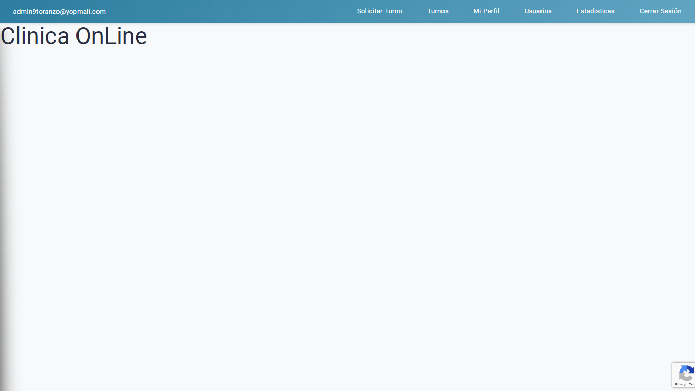

From the welcome page, users can log in or register, then access their Patient, Specialist or
Admin profile.

**User registration**

- **Patients:** first name, last name, age, national ID, health insurance, email, password, and
  2 profile pictures.
- **Specialists:** first name, last name, age, national ID, specialty, email, password, and a
  profile picture.

**Login**

- Specialists can only log in once their account is approved by an Admin.
- Patients must verify their email before logging in.

**User management (Admin)**

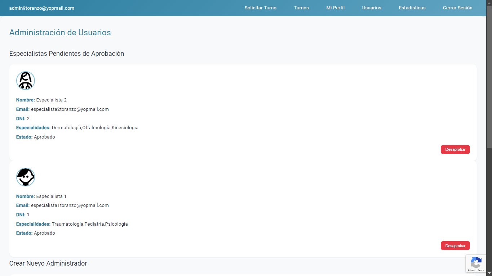

Admins can view and edit user data, enable/disable accounts, and create new users (including
other admins).

## Sprint 2: Appointment management

**My appointments - Patient**

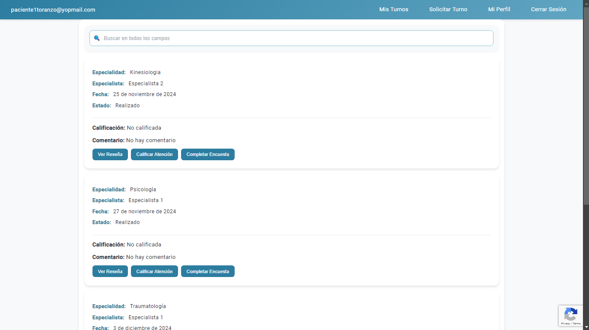

Patients can check their appointments, cancel them (if not yet completed), view reviews, fill
out surveys, or rate the specialist's care.

**My appointments - Specialist**

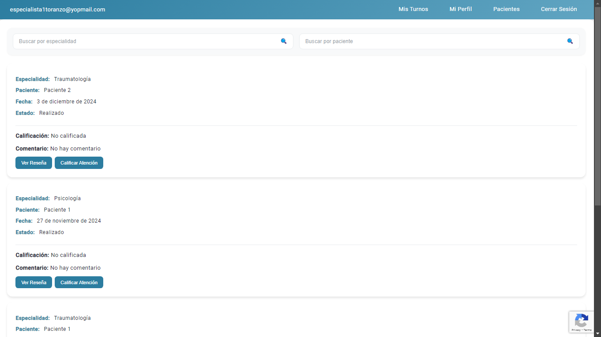

Specialists can manage their assigned appointments: accept, reject, cancel, or mark them as
completed.

**Appointments - Admin**

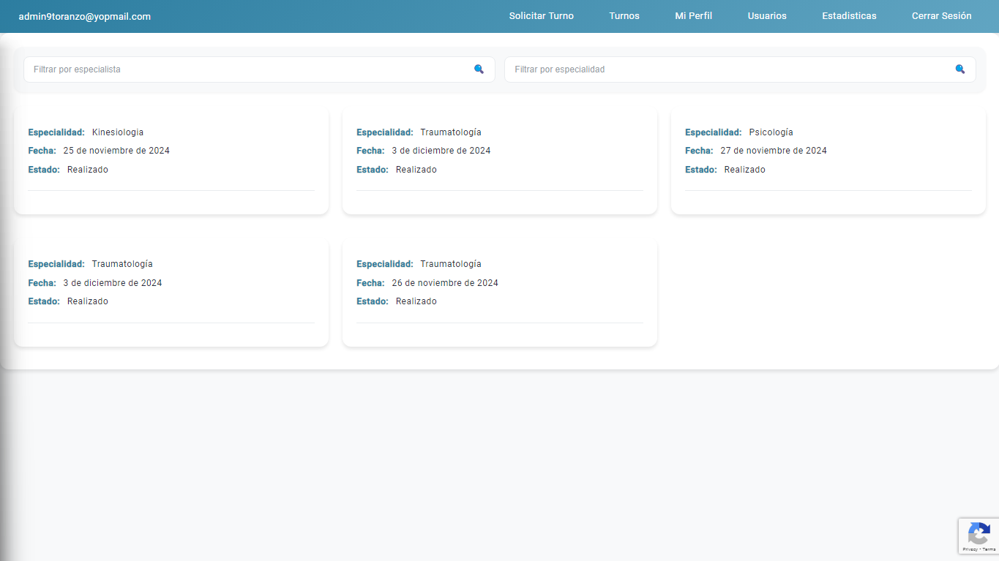

Admins can see every appointment in the clinic and cancel, accept, or reject any that haven't
happened yet.

**Requesting an appointment**

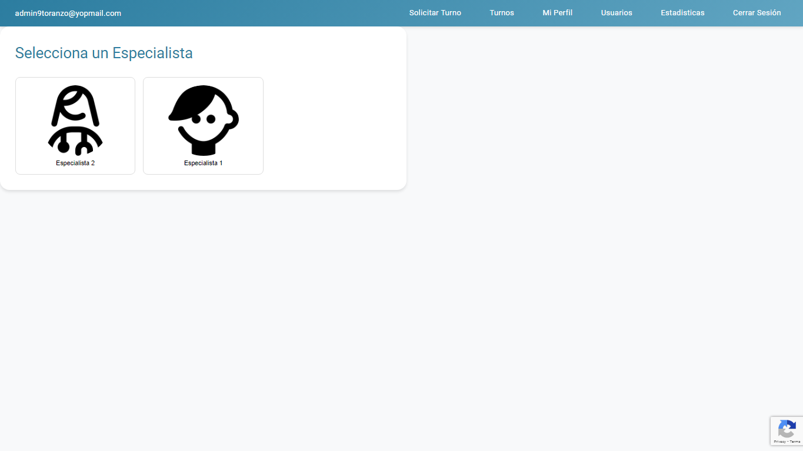

Patients and admins can request new appointments by choosing a specialty, specialist, date and
time slot.

**My profile**

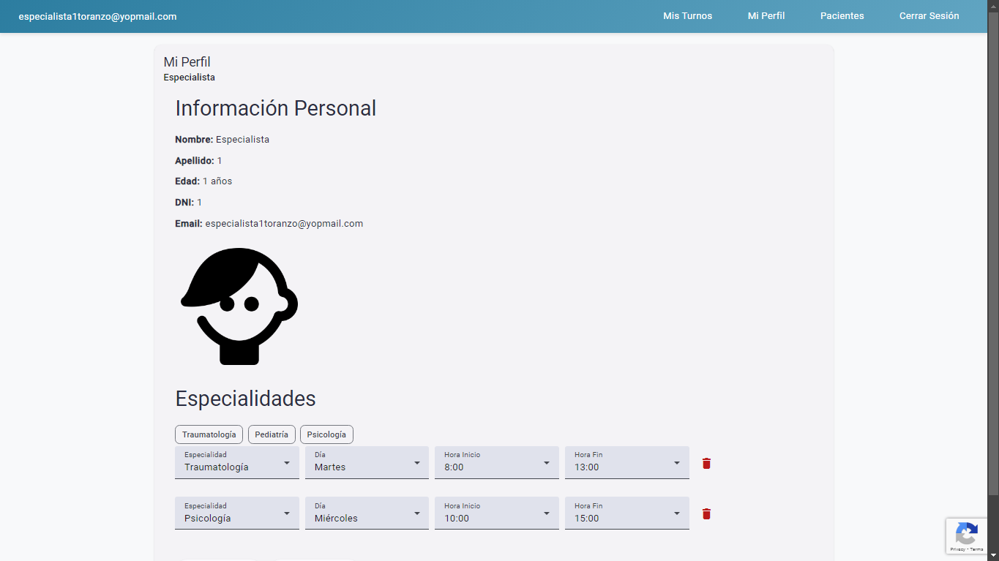

Every user can view and edit their profile: name, picture, and other details.

## Sprint 3: Medical records

**Medical record - Patient**

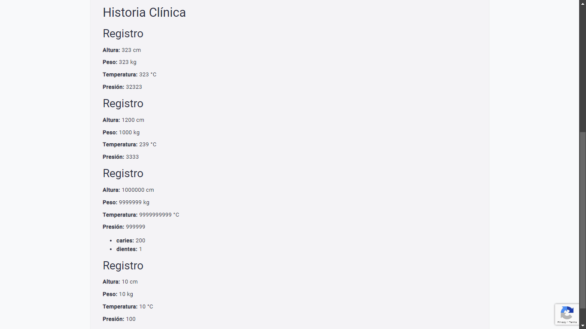

Patients can view their medical record, which specialists fill in after each appointment.

**Users - Admin**

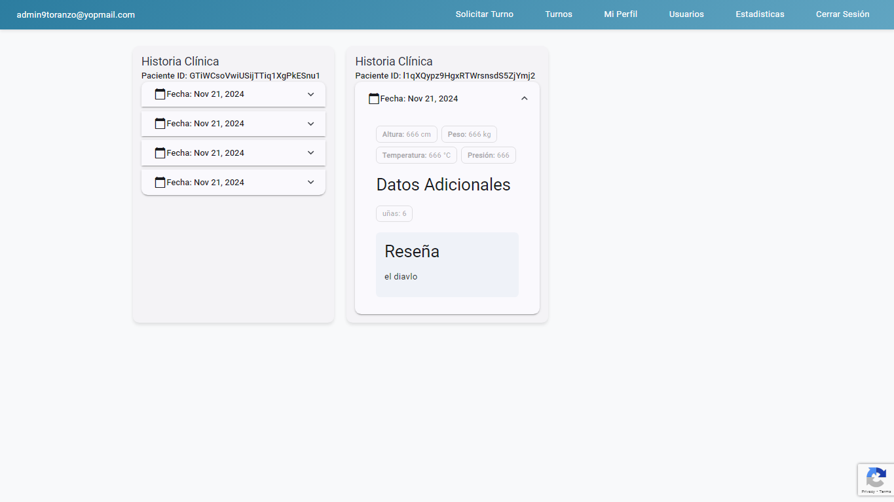

Admins have full access to patient and specialist data and can manage patients' medical records.

## Sprint 4: Reports and stats

**Access log**

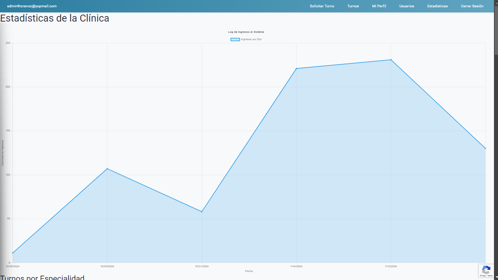

Admins can view a detailed log of system logins, with user and access date.

**Appointment stats**

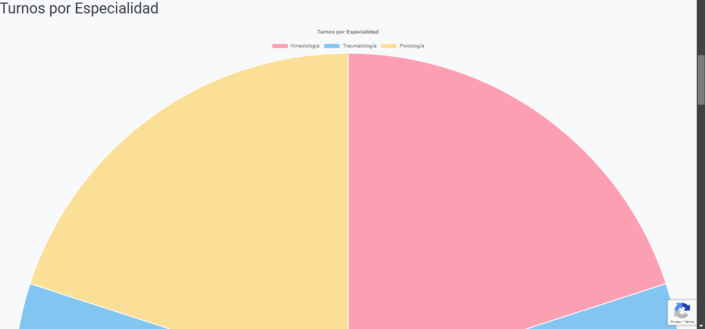

Admins can view appointment stats: counts by specialty, day, and specialist.

## Other features

- Captcha on user registration
- Advanced filters for appointment and patient search
- Report export as Excel or PDF
